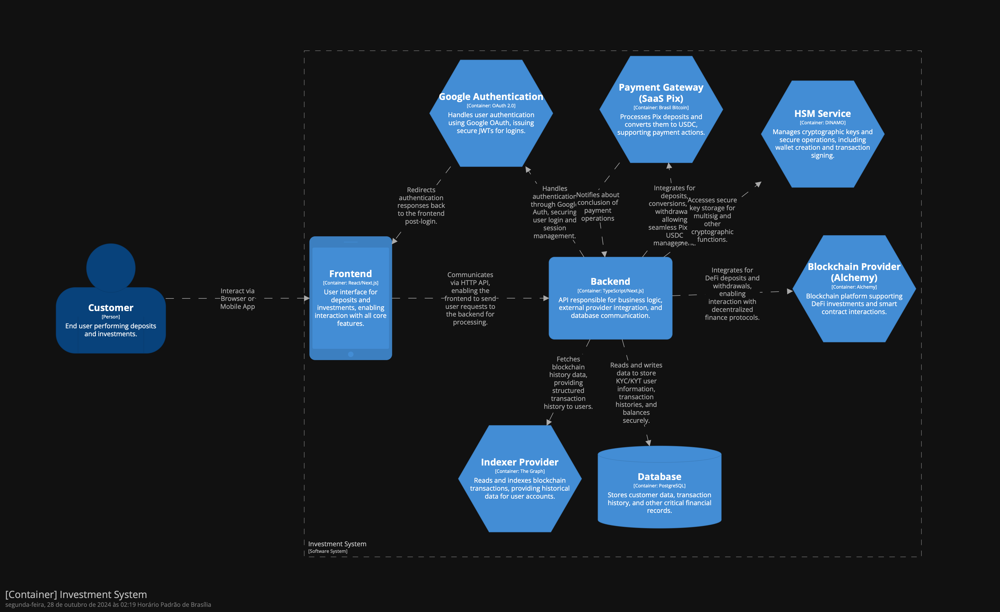
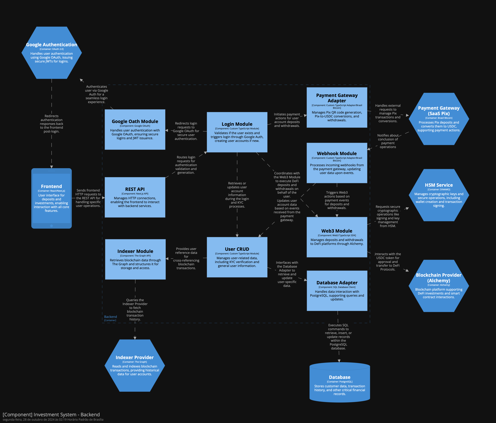

# Implementation

## 1. Escolha de Tecnologias

| Area           | Tech                    | motivo                                     |
| -------------- | ----------------------- | ------------------------------------------ |
| Front-end      | Typescript (React/Next) | fácil de usar, alta integração dom backend |
| Backend        | Typescript (Next)       | fáil configuração do deploy                |
| Banco de Dados | PostgreSQL              | fácilidade de uso                          |
| Blockchain     | Arbitrum (alchemy)      | maior liquidez                             |
| Auth           | Google                  | menor fricção para o cliente final         |
| Payment        | Brasil Bitcoin          | parceria e fácilidade de uso               |
| Indexer        | The Graph               | maturidade da solução                      |
| HSM            | DINAMO Networks         | parceria e segurança                       |
| DevOps         | Vercel                  | no-Ops, fácilidade de configuração         |

## 2. Context View

## 3. Components View

